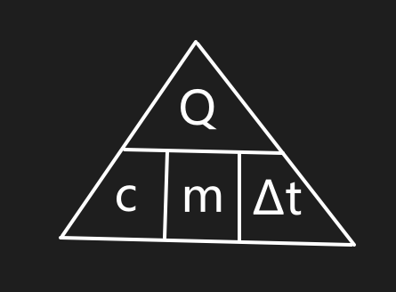

## Introduction

### A: Preface

那还是很遗憾的

受难日没有祷告  
正如遥不可及的明天  
也似平静的澜波

这是最后的祷告

### B: 2026/2/24

Though anything what I go through telling me:  
我所学的一切不必然忠诚于完整的体系，  
我也不必然所需去建构忠实的伊甸园。

然而我这样做了，  
做得很彻底，  
以至于我忘记了——  
我从来不是这样做的。

向来不适地学习完整的建构，  
向来愉快地享受琐碎的解构，  
这正是我所做的——  
我享受琐碎的知识，  
厌恶系统地学习，  
——一直如此。

我在记忆的残卷里寻找一个  
为何至此的原因，  
只涌现出来一个美好的结局：  
当掌声响起  
——为我最后的成功，  
当掌声响起  
——为我还有未来的过去，  
当掌声响起  
——为我腐心刺骨的温暖，  
当掌声响起  
——在鲜花盛开的地方。

对不起，在黎明来临之前，  
我连这最后的温暖也传达不到你，  
长夜已至，希望你们都能达到黎明。

可笑呵，这早已默许的成功的结局
可笑呵，这早已默许的自满的骗局
可笑呵，这注定团圆的美满的结局

太阳所迷失的……  
云朵所坠落的……  
天空所陨灭的……

我没有照亮他人的能力  
——从来没有  
我没有温暖他人的能力  
——从来没有  
我没有……  
我没有保护自己的力气  
我没有独闯黑夜的勇气  
我没有决定长跑的毅气

对不起，我所迷失的。

为什么——  
太阳落得那么快？  
就像远山上一团火球  
缓缓坠落，  
点燃了山上的青松  
如同灼红的纸页，  
回光般，不见了星火  
只留下一片，已染得
姹紫嫣红的天空

再见——  
光明所照耀的  
黑暗所笼罩的  
伸张之正义的  
视之而不见的

在悬崖上奔跑
不必在意旁人的呼喊
在悬崖上奔跑
不必在意深渊的哭喊
在悬崖上奔跑
不必在意刺骨的风寒

我想拣一朵花
在那最凶险的悬崖边
我想走一条路
在那最晦暗的密林里
我想写一篇章
在这最后的倒计时里

我感到飘飘然  
感到绝望  
感到感动  
感到一只脚踏入虚空

凌晨的风刺骨  
恍然间舒展开翅膀  
想要飞去掌声响起之处

回头看见明天  
如常吃过早饭  
偶然暖起身子  
拾掇拾掇衣服  
背上轻盈书包  
勇士挺剑而起

顿挫不安的  
踌躇满志的  
生灵涂炭的  
光芒四射的  
包装这信笺——  
所未完成的  
残破不堪的  
苦不堪言的  
荡坠不安的  
走入那天堂——  
噩梦所在的  
不可或缺的  
玉葺雪白的  
鲜花盛开的

清晨的雨朗润  
惊醒昨夜的凌晨  
折断我必将坠落的羽翼

听——  
天在为你哭泣  
听——  
这天然的挽歌  
听——  
战鼓为你击响

昨日刚洗完的书包  
昨日整理过的书架  
往日那本没看的书  
往日那首未竟的诗

凌晨的风刺骨  
张开双臂去拥抱  
一片新的生活

所以回头吧

不必忠于别处的芬芳  
偶尔感受芝兰之室的香气

太阳没有升起  
太阳还会升起  
太阳已经升起  
或者——  
太阳是否升起  
并不重要

如果——  
你是现实的浪花拍醒  
走入那片永夜  
写一首  
不回的诗

如果——  
你是烂漫的堂吉诃德  
闯入那片永夜  
写一首疯癫的生活

如果——  
你是失败的成功者  
不必向往  
未曾存在的伊甸园

或者——  
你是功成名就  
不要忘记  
黑夜是你的来路

你所意愿的  
你所决定的  
太阳与夜灯

谢谢，  
所有的你们  
——不曾忽视的  
——不曾冷漠的  
——不曾伤害的

希望在你们之处升起
也必将在你们之中绽放

所以回头吧——
回到希望诞生的地方
回到我忠实的琐碎
回到发轫时最终的平凡之路
回到腐烂而灿烂的现实

你好，  
光明所照耀的  
黑暗所笼罩的  
伸张之正义的  
视之而不见的

我想走一条路  
千万蹄过踏无痕  
我想走一条路  
杻镣蹁跹终盛放  
我想走一条路  
一条通向未来的路  
——不论它是寒冷或是烂漫

我想点起一颗台灯，  
照亮一片宇宙。

## Notes

### Physics

#### 声学：三要素

**音调** depend on *频率*  
**音色** depend on *材料/结构*  
**响度** depend on *振幅*

#### 变形公式技巧

如图所示，把原始公式左边的字母放在金字塔尖（当然你也可以把它想象成 $\color{brown}答辩$）。把右边的量放在下面，有几个分几格。这时我们要求能求任一量的变形公式，只需把那个量领出来，把它和金字塔用等号连起来起来，把金字塔上下层的分割线当作分数线（是分数的分数线，不是成绩的分数线哦），下面的隔板去掉，架子去掉就可以啦~

#### 常用常量

##### 力学

**重力加速度：** $g\approx9.8\,\mathrm{N/kg}$  
**水的密度：** $\rho_{水}=1.0\times10^{3}\,\mathrm{kg/m^{3}}$  
**标准大气压：** $p_{0}=1.013\times 10^5 \,\mathrm{Pa}$

##### 热学

**水的比热容：** $c_{水}=4.2\times10^{3}\,\mathrm{J/(kg\cdot \degree C)}$

##### 光学

**真空光速：** $C=3.0\times 10^{8}m/s$

##### 声学

**空气中的声速（常温）：** $340\,\mathrm{m/s}$

##### 电学

**一节干电池电压：** $1.5\,\mathrm{V}$  
**家庭电路电压（我国）：** $220\,\mathrm{V}$ （频率 $55\,\mathrm{Hz}$）  
**安全电压：** 不高于 $36\,\mathrm{V}$

### Mathematical

……
