### 1 有理数的分类

| 按数的“整分性”分类                                                                                                                                                                                                    | 按数的“正负性”分类                                                                                                                                                                                                        |
| :------------------------------------------------------------------------------------------------------------------------------------------------------------------------------------------------------------ | :---------------------------------------------------------------------------------------------------------------------------------------------------------------------------------------------------------------- |
| $\begin{aligned} \text{有理数} \begin{cases} \text{整数} \begin{cases} \text{正整数} \\ \text{零} \\ \text{负整数} \end{cases} \\ \text{分数} \begin{cases} \text{正分数} \\ \text{负分数} \end{cases} \end{cases} \end{aligned}$ | $\begin{aligned} \text{有理数} \begin{cases} \text{正有理数} \begin{cases} \text{正整数} \\ \text{正分数} \end{cases} \\ \text{零} \\ \text{负有理数} \begin{cases} \text{负整数} \\ \text{负分数} \end{cases} \end{cases} \end{aligned}$ |

### **2 绝对值**

绝对值的代数定义

$$
|a|=\begin{cases}
 a & \text{ if } a>0 \\
 0 & \text{ if } a=0 \\
 -a & \text{ if } a<0
\end{cases}
$$
### 3 图形的认识

直线、射线、线段之间的区别

|      | 直线                                  | 射线                                    | 线段                                    |
| ---- | ----------------------------------- | ------------------------------------- | ------------------------------------- |
| 图形   | 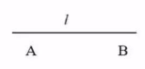 | 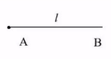 | 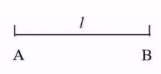 |
| 表示方法 | 直线 $AB$ 或 直线 $l$                    | 射线 $AB$ 或 射线 $l$                      | 线段 $AB$ 或 线段 $l$                      |
| 端点个数 | $0$ 个                               | $1$ 个                                 | $2$ 个                                 |
| 延伸方向 | 向两边无限延伸                             | 向一边无限延伸                               | 不能延伸                                  |
| 有关性质 | 两点确定一条直线                            | 无                                     | 两点之间，线段最短                             |

### 4 整式乘法

同底数幂的乘法：$a^{m}\cdot a^{n}=a^{m+n}\,(m,n\in\mathbb{Z}_{+})$

幂的乘方：$(a^{m})^{n}=a^{mn}\,(m,n\in\mathbb{Z}_{+})$

积的乘方：$(ab)^{n}=a^{n}b^{n}\,(n\in\mathbb{Z}_{+})$

底数的推广：
- $(-a)^{n}=\begin{cases} a^{n} & \text{ if } a \in 2\mathbb{Z} \\ -a^{n} & \text{ if } a\in 2\mathbb{Z}+1\end{cases}$
- $(b-a)^{n}=\begin{cases} (a-b)^{n} & \text{ if } a \in 2\mathbb{Z} \\ -(a-b)^{n} & \text{ if } a\in 2\mathbb{Z}+1\end{cases}$

乘法公式：
- 平方差公式：$(a+b)(a-b)=a^{2}-b^{2}$
- 完全平方公式：$(a\pm b)=a^{2}\pm 2ab+b^{2}$

平方差公式常见变化形式：
- 位置变化：$(-b+a)(b+a)=(a+b)(a-b)=a^{2}-b^{2}$
- 符号变化：$(-a+b)(-a-b)=(-a)^{2}-b^{2}=a^{2}-b^{2}$
- 系数变化：$(2x+3y)(2x-3y)=(2x)^{2}-(3y)^{2}=(2x)^{2}-(3y)^{2}=4x^{2}-9y^{2}$
- 指数变化：$(m^{2}+n^{2})(m^{2}-n^{2})=(m^{2})^{2}-(n^{2})^{2}=m^{4}-n^{4}$
- 增项变化$(a+b+c)(a+b-c)=(a+b)^{2}-c^{2}=\dots$
- 增因式变化：$(-a-b)(-a+b)(a-b)(a+b)=[(-a)^{2}-b^{2}](a^{2}-b^{2})=\dots$
- 连用公式变化：$(a+b)(a-b)(a^{2}+b^{2})(a^{4}+b^{4})=(a^{2}-b^{2})(a^{2}+b^{2})(a^{4}+b^{4})=(a^{4}-b^{4})(a^{4}+b^{4})=a^{8}-b^{8}$

完全平方公式常见的变化形式：
- $a^{2}+b^{2}=(a+b)^{2}-2ab$
- $a^{2}+b^{2}=(a-b)^{2}+2ab$
- $(a+b)^{2}=(a-b)^{2}+4ab$
- $(a-b)^{2}=(a+b)^{2}-4ab$
- $(a+b)^{2}+(a-b)^{2}=2(a^{2}+b^{2})$
- $(a+b)^{2}-(a-b)^{2}=4ab$
- $(a+b+c)^{2}=a^{2}+b^{2}+c^{2}+2ab+2bc+2ac$

### 5 数据分析

平均数与方差公式

| 名称    | 公式                                                                                                   |
| ----- | ---------------------------------------------------------------------------------------------------- |
| 平均数   | $\overline{x}=\frac{x_{1}+x_{2}+\dots+x_{n}}{n}$                                                     |
| 加权平均数 | $\frac{x_{1}w_{1}+x{2}w{2}+\dots+x_{n}w_{n}}{w_{1}+w_{2}+\dots+w_{n}}$                               |
| 方差    | $s^{2}=\frac{[(x_{1}-\overline{x})^{2}+(x_{2}-\overline{x})^{2}+\dots+(x_{n}-\overline{x})^{2}]}{n}$ |

### 6 分式的运算

分式的基本性质：
- $\frac{a\cdot c}{b\cdot c}=\frac{a}{b}(b\ne0,\,c\ne0)$
- $\frac{a\div b}{b\div c}=\frac{a}{b}(b\ne0,\,c\ne0)$
- $\frac{-a}{-b}=\frac{a}{b}$
- $\frac{-a}{b}=\frac{a}{-b}=-\frac{a}{b}\,(b\ne0)$

分式的乘法：$\frac{a}{b} \cdot \frac{c}{d} = \frac{ac}{bd} \quad (b \neq 0, \, d \neq 0)$

分式的除法：$\frac{a}{b} \div \frac{c}{d} = \frac{a}{b} \cdot \frac{d}{c} = \frac{ad}{bc} \quad (b \neq 0, \, c \neq 0)$

分式的加减法：
- 同分母：$\frac{a}{b} \pm \frac{c}{b} = \frac{a \pm c}{b} \quad (b \neq 0)$
- 异分母：$\frac{a}{b} \pm \frac{c}{d} = \frac{ad}{bd} \pm \frac{bc}{bd} = \frac{ad \pm bc}{bd} \quad (b \neq 0, \, d \neq 0)$

分式的乘方：$(\frac{a}{b})^{n} = \frac{a^{n}}{b^{n}} \quad (b \neq 0, \, n\in\mathbb{Z}_{+})$

同底数幂的除法：$a^{m} \div a^{n} = a^{m-n} \quad (a \neq 0, \, m, n \in\mathbb{Z}_{+})$

零指数幂：$a^{0} = 1 \quad (a \neq 0)$

负整指数幂：$a^{-n} = \frac{1}{a^{n}} \quad (a \neq 0, \, n \in\mathbb{Z}_{+})$

解分式方程的一般步骤：
1. 去分母：在方程左右两边都乘以最简公分母，化为整式方程。
2. 解方程：解整式方程。
3. 验根：把整式方程的根代入最简公分母，若结果为零，则这个根是方程的增根，必须舍去。

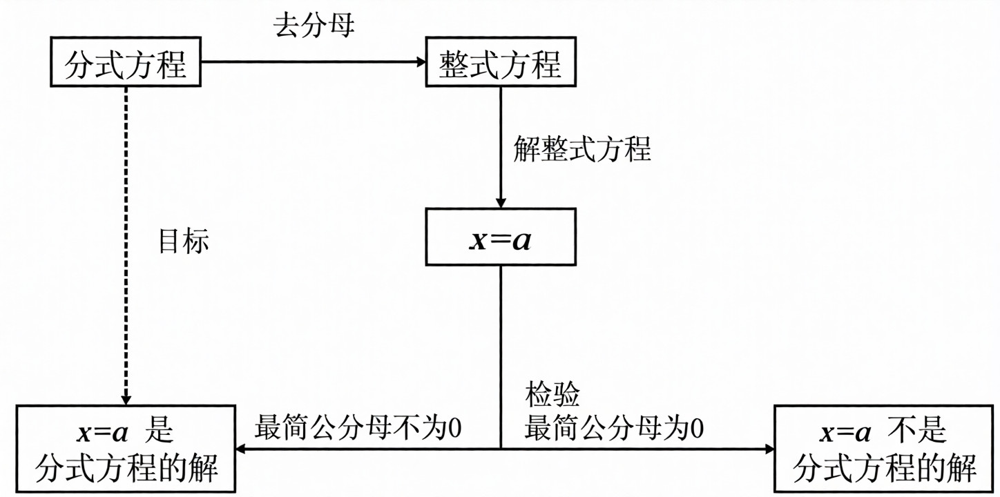

:::tip

**示例：解分式方程**

方程：
$$\frac{2}{x-1} - \frac{1}{x+2} = \frac{3}{(x-1)(x+2)}$$

**步骤 1：去分母**  
最简公分母为 $(x-1)(x+2)$。方程两边同时乘以 $(x-1)(x+2)$：
$$
2(x+2) - 1(x-1) = 3
$$
化简得整式方程：
$$
2x+4 - x + 1 = 3
$$
$$
x + 5 = 3
$$
**步骤 2：解整式方程**  
移项：
$$
x = 3 - 5 = -2
$$
**步骤 3：验根**  
将 $x = -2$ 代入最简公分母 $(x-1)(x+2)$ 检验：
$$
(-2-1)(-2+2) = (-3) \times 0 = 0
$$
由于结果为 0，说明 $x = -2$ 使原方程分母为零，是**增根**。

**结论**  
原分式方程**无解**（所有根均为增根）。

:::

### 7 全等三角形

证明三角形全等的常见思路：

1. 已知两边：
$$\begin{cases} \text{找夹角} \to \text{SAS} \\ \text{找直角} \to \text{HL} \\ \text{找第三边} \to \text{SSS} \end{cases}$$

2. 已知一边一角：
$$\begin{cases} \text{一边为角的对边} \to \text{找另一角} \to \text{AAS} \\ \text{一边为角的邻边} \begin{cases} \text{找夹角的另一边} \to \text{SAS} \\ \text{找夹边的另一角} \to \text{ASA} \\ \text{找边的对角} \to \text{AAS} \end{cases} \end{cases}$$

3. 已知两角：
$$\begin{cases} \text{找夹边} \to \text{ASA} \\ \text{找其中一角的对边} \to \text{AAS} \end{cases}$$

### 8 等式与不等式的区别

| 等式的性质                                                                                                              | 不等式的性质                                                                                                                                                          |
| :----------------------------------------------------------------------------------------------------------------- | :-------------------------------------------------------------------------------------------------------------------------------------------------------------- |
| 对称性：若 $a=b$，则 $b=a$                                                                                                | 反对称性：若 $a>b$，则 $b<a$                                                                                                                                            |
| 传递性：若 $a=b$，$b=c$，则 $a=c$                                                                                          | 传递性：若 $a>b$，$b>c$，则 $a>c$                                                                                                                                       |
| 其他性： 若 $a=b$，则 $a \pm c = b \pm c$ 若 $a=b$，则 $ac = bc$ 若 $a=b$，$c \neq 0$，则 $\dfrac{a}{c} = \dfrac{b}{c}$ | 其他性： 若 $a>b$，则 $a \pm c > b \pm c$ 若 $a>b$，$c>0$，则 $ac > bc$，$\dfrac{a}{c} > \dfrac{b}{c}$ 若 $a>b$，$c<0$，则 $ac < bc$，$\dfrac{a}{c} < \dfrac{b}{c}$  |

:::tip
**为什么不等式两边乘负比较符取反？**

如有下式：

$$a>b$$

当 $a>b,\,c<0$ 的时候，两边同乘 $c$. 神奇的事发生了，我们所得到的结果并不是 $\color{red}{ac>bc}$ 而是 $\color{green}{ac<bc}$. 那么，让我们带入一组常数进行运算，从上帝视角看看到底发生了什么

$$
\begin{cases}
a=1 \\
b=2 \\
c=-3
\end{cases}
$$

$a>b$ 即 $2>1$，当我们乘上 $c$ 也就是 $-3$ 时，让我们先涂掉比较符，

$$2\times(-3)\,▢\,1\times(-3)$$

注意看

$$-(2\times3)\,▢\,-(1\times3)$$
$$-6\,▢\,-3$$
于是，得到了我们所期盼（也许）的成果
$$-6<-3$$
$$\color{green}{ac<bc}$$
但如果 $c=3$ 则式如

$$2\times3\,▢\,1\times3$$
$$6\,▢\,3$$
$$6>3$$
$$\color{red}{ac>bc}$$
两者的区别就在于如果 $c$ 为负，那么比较符两边都会多出一个负号。负号旁的数越大，数越小；负号旁的数越小，数越大。那么原本比较符旁左大右小，现在就成了左小右大，比较符自然就要转上半圈——从 $>$ 变成 $<$. 形象化地理解就是负号让数轴转了半圈——原本指向右边，现在却指向左边——自然比较符就跟着一起转啦~
:::

### 9 一元一次方程与一元一次不等式的区别

|          | 一元一次方程                                                     | 一元一次不等式                                                                                                   |
| :------- | :--------------------------------------------------------- | :-------------------------------------------------------------------------------------------------------- |
| **解法步骤** | (1) 去分母  (2) 去括号 (3) 移项 (4) 合并同类项 (5) 系数化为 $1$ | (1) 去分母 (2) 去括号 (3) 移项 (4) 合并同类项 (5) 系数化为 $1$ *在上面的步骤 (1) 和 (5) 中，如果乘的因数或除数是负数，则不等号的方向要改变* |
| **解**    | 一元一次方程只有一个解                                                | 一元一次不等式一般有无数多个解                                                                                           |

### 10 一元一次不等式组解集的基本类型

| 不等式组 (设 $a < b$)                               | 在同一数轴上的表示                             | 解集              | 口诀            |
| :--------------------------------------------- | :------------------------------------ | :-------------- | :------------ |
| $\begin{cases} x \le a \\ x \le b \end{cases}$ | 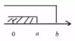 | $x \le a$       | 同小 取小         |
| $\begin{cases} x \ge a \\ x \ge b \end{cases}$ | 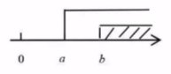 | $x \ge b$       | 同大 取大         |
| $\begin{cases} x \ge a \\ x \le b \end{cases}$ | 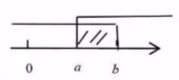 | $a \le x \le b$ | 大小、小大中间找      |
| $\begin{cases} x \le a \\ x \ge b \end{cases}$ | 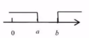 | 空集              | 大大、小小无处找 (无解) |

:::tip
有的聪明的小盆友可能就要问了——**“为什么第四种情况不能是解同时符合两个不等式呢？”**

其实啊，这就像有一个方程组，同时给出 $x=1$ 和 $x=2$. 但数学是确定的，所以 $x$ 不能同时有两个值。

$$
\color{red}
\begin{cases}
x=1 \\
x=2
\end{cases}
$$
那这时聪明的小朋友可能又要问了——**“那 $(x-1)(x-2)=0$ 不就是一个同时满足 $x=1$ 和 $x=2$ 的方程吗？”**

注意，当我们描述 $(x-1)(x-2)=0$ 这个方程的解的时候，我们说的是“方程的解为 $x=1$ **或** $x=2$”而不是“方程的解为 $x=1$ **和** $x=2$”，这就是 **逻辑合取**（$\wedge$） 与 **逻辑析取**（$\vee$） 的区别啦~ 也就是为什么我们要写 $(x-1)(x-2)=0$ 的解集为

$$
\color{green}
\begin{cases}
x_{1}=1 \\
x_{2}=2
\end{cases}
$$

而不是

$$
\color{red}
\begin{cases}
x=1 \\
x=2
\end{cases}
$$
:::

### 11 二次根式

二次根式的性质

- $(\sqrt{a})^2 = a \quad (a \ge 0)$
- $\sqrt{a^2} = |a| = \begin{cases} a & (a > 0) \\ 0 & (a = 0) \\ -a & (a < 0) \end{cases}$

$\sqrt{a^{2}}$ 与 $(\sqrt{a})^{2}$ 的区别与联系

| 公式                                         | 意义                                                      | 字母 $a$ 的取值范围                    | 运算结果                             | 联系                                            |
| :----------------------------------------- | :------------------------------------------------------ | :------------------------------ | :------------------------------- | :-------------------------------------------- |
| $\sqrt{a^{2}}$ 
 $(\sqrt{a})^{2}$ | $\sqrt{a \cdot a}$ 
 $\sqrt{a} \cdot \sqrt{a}$ | $a$ 可为任意实数 
 $a \ge 0$ | $\lvert a \rvert$ 
 $a$ | 当 $a \ge 0$ 时，$\sqrt{a^{2}} = (\sqrt{a})^{2}$ |

二次根式的乘法：$\sqrt{a} \cdot \sqrt{b} = \sqrt{ab} \quad (a \ge 0, b \ge 0)$

二次根式的除法：$\frac{\sqrt{a}}{\sqrt{b}}=\sqrt{\frac{a}{b}}(a\geq0,b>0)$

商的算术平方根：$\sqrt{\frac{a}{b}}=\sqrt{\frac{a}{\sqrt{b}}}(a\geq0,b>0)$

### 12 解直角三角形

常用的性质：
- 直角三角形中有一个是直角.
- 直角三角形中两个锐角互余.
- 直角三角形中，$30\degree$ 角所对的边等于斜边的一半.
- 直角三角形中，斜边上的中线等于斜边的一半.
- 直角三角形勾股定理：$a^{2}+b^{2}=c^{2}$（$a$、$b$ 为直角边，$c$ 为斜边）
- 角平分线性质：角平分线上的点到角两边的距离相等
- 角平分线的性质的逆定理：角内部到这个角的两边距离相等的点在角平分线上

判定直角三角形的方法：
- 证明三角形中有一个角为直角.
- 证明三角形中两个锐角互余.
- 证明三角形三边满足勾股定理（$a^{2}+b^{2}=c^{2}$）.

### 13 四边形

多边形常用公式：$\left\{\begin{matrix}n\,\text{边形内角和公式}:(n-2)\cdot180^{\circ}\\ \text{求正}\,n\,\text{边形各内角度数}:\frac{(n-2)\cdot180^{\circ}}{n}\end{matrix}\right.$

正方形、矩形、菱形和平行四边形的关系：
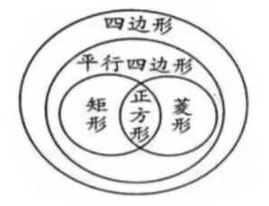
四边形的性质与判定：

| 图形                                     | 定义                          | 性质                                                                                   | 判定                                                                                       |
| :------------------------------------- | :-------------------------- | :----------------------------------------------------------------------------------- | :--------------------------------------------------------------------------------------- |
| 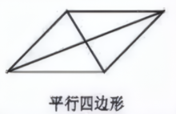  | 两组对边分别平行的四边形叫做平行四边形         | 边：对边平行且相等 角：对角相等，邻角互补 对角线：对角线互相平分 对称性：中心对称图形                                | 两组对边分别平行的四边形是平行四边形。 两组对边分别相等的四边形是平行四边形。 一组对边平行且相等的四边形是平行四边形。 对角线互相平分的四边形是平行四边形。 |
| 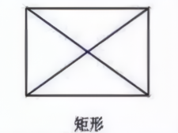  | 有一个角是直角的平行四边形叫做矩形。          | 边：对边平行且相等 角：四个角都是直角 对角线：对角线互相平分且相等 对称性：既是中心对称图形，也是轴对称图形                     | 有一个角是直角的平行四边形是矩形。 有三个角是直角的四边形是矩形。 对角线相等的平行四边形是矩形。                                  |
| 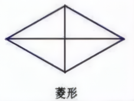 | 有一组邻边相等的平行四边形叫做菱形           | 边：对边平行，四条边都相等 角：对角相等，邻角互补 对角线：对角线互相垂直平分，每一条对角线平分一组对角。 对称性：既是中心对称图形，也是轴对称图形  | 有一组邻边相等的平行四边形是菱形。 四条边相等的四边形是菱形。 对角线互相垂直的平行四边形是菱形。                                  |
| 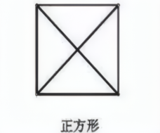 | 有一组邻边相等且有一个角是直角的平行四边形叫做正方形。 | 边：对边平行，四条边都相等 角：四个角都是直角 对角线：对角线互相垂直平分且相等，每一条对角线平分一组对角。 对称性：既是中心对称图形，也是轴对称图形 | 有一组邻边相等且有一个角是直角的平行四边形是正方形。 有一个角是直角的菱形是正方形。 有一组邻边相等的矩形是正方形。                         |
| 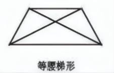 | 两腰相等的梯形叫做等腰梯形               | 边：两腰相等 角：同一底上的两底角相等 对角线：对角线相等 对称性：轴对称图形                                     | 两腰相等的梯形是等腰梯形。 在同一底上的两个底角相等的梯形是等腰梯形。                                                   |
