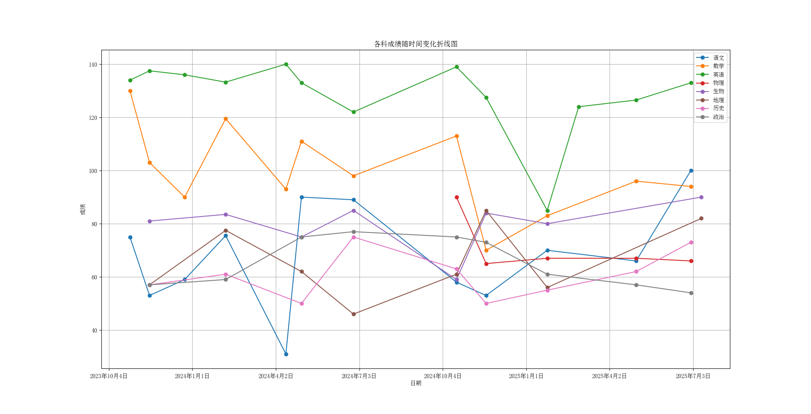

## 一

我的教师朋友们，你们是否觉得你们布置的作业对我来说是否有一点儿太多了呢？

诚然，我知道你们布置这些作业是为我的利好。我也看到你们有努力在为我们减轻负担——采取灵活的罚抄方式、给予许多延期提交的机会等。然而，就是这样的作业、这样的宽裕已然是我不可能完成的了，已然让它们没有了意义。让我们来算个数！下面是国庆合中秋假期作业（不含之前欠的）与我的解题速度估计值以及完成所需时间估计 *（原谅我没有对主观估计值合客观已知值做验算，但误差该是可接受的）*：

| 科目     | 语文  | 数学  | 英语  | 物理     | 化学     | 历史  | 政治  | 合计     |
| ------ | --- | --- | --- | ------ | ------ | --- | --- | ------ |
| 题数     | 25  | 54  | 193 | ~120.9 | ~75.5  | 0   | ~0  |        |
| 平均每题耗时 | 20  | 12  | 3   | 8      | 15     | 10  | 15  |        |
| 所需时间   | 500 | 648 | 579 | 967.2  | 1132.5 | 0   | 0   | 3826.7 |

*（题目按以形如 `1.` 的编号为题序的算，“题数”中加“~”的表示由估算得出，“作业平均每题耗时”精确到小数点后三位，单位：min）*

有些惊人是吗？我需要 3826.7 分钟（合约 **63.778 小时**）来完成这 8 天的作业！合约每天要付出约 **7.972 小时**，**一刻不停**地写才能完成这些作业！

那么你可能会问 **“那你考试的速度和这咋也对不上啊！”**

这是因为大的考试给我很大紧张感，——虽然我父母不苛责我的成绩，但我自对这成绩确是很在意；自然我就写的快，而少有分心的时候了。写作业之虽然有你们的强求，但我确乎是没有什么心意在写作业上的，总是心猿意马；终末的结果是—— **写不完！**

这样的估算大抵还是简约了，那么再说一个模糊但有代表性的事实：在开学的第一周，那时还没有买什么别的练习，大约是符合司法部、教育部要求的本底量吧；但那时我就已经略略感到压力了，但尚且是可以自己写得完。但后来呢？逐渐多买练习了，我便猛然坠落谷底，再也写不完。而且作业一天一天、一页一页地欠下去，无底洞、滚雪球似的还不完。至于为什么你不知道，要么是你所教的那科布置的少，我正好写得完；要么是我班的检察比较疏松了。我初还试着顶一顶、还一还，但终于无可耐得抄一抄，而初我抄的时候是要考虑如何得到这答案的，可终于是连这想一想的底线也没了。国庆节时我已欠了至少 30 页作业，而今恐怕要翻番。

如此局势，我自然可以硬顶下去，应付下去，半推半就下去。但我不愿见、不会见这样的情况再发生在我身上。我是视考高中、考大学如命的人，这样下去，恐怕是小命不保！故我书此信的意义，在和你探讨一个可能的出路，或者至少比现在的情况要好的方案。

## 二

上图是我七八年级历次考试的成绩（包括“生地会考”），而下表是我历学期各科的听课程度和自主完成的作业完成占所有作业比重自评 *（原谅我没有时间画热度图、同样没有对照客观值做校验，但意思是清楚的）*：

| 学科  | 七上   | 七下  | 八上   | 八下  | 总计   |
| --- | ---- | --- | ---- | --- | ---- |
| 语文  | 80   | 50  | 80   | 20  | 57.5 |
| 数学  | 80   | 20  | 20   | 20  | 35   |
| 英语  | 80   | 30  | 70   | 80  | 65   |
| 物理  |      |     | 80   | 30  | 55   |
| 生物  | 100  | 100 | 100  | 100 | 100  |
| 地理  | 80   | 40  | 10   | 10  | 35   |
| 历史  | 90   | 90  | 90   | 90  | 90   |
| 政治  | 80   | 20  | 10   | 10  | 30   |
| 全科  | 84.3 | 50  | 57.5 | 45  | 59.2 |

（听课程度/%）

| 学科  | 七上   | 七下   | 八上   | 八下   | 总计   |
| --- | ---- | ---- | ---- | ---- | ---- |
| 语文  | 90   | 70   | 80   | 80   | 80   |
| 数学  | 80   | 10   | 10   | 10   | 27.5 |
| 英语  | 90   | 10   | 10   | 10   | 30   |
| 物理  |      |      | 10   | 10   | 10   |
| 生物  | 100  | 100  | 100  | 90   | 97.5 |
| 地理  | 90   | 10   | 20   | 10   | 32.5 |
| 历史  | 80   | 10   | 10   | 10   | 27.5 |
| 政治  | 80   | 40   | 50   | 50   | 55   |
| 全科  | 87.1 | 35.7 | 36.2 | 33.7 | 48.1 |

（自主完成作业占比/%）

看罢，你也许感到惊讶：惊讶于“这样 **不听课、不写作业** 的学生竟然能考进一班？”，惊讶于“这样的 **不听课、不写作业** 的学生还能有这样的成绩？”

但请放下心来，冷静的看看—— **到底发生了什么？**

## 三

这两年发生了许许多多的事，恐怕你看不完（恐怕我写不完），所以先写一个 Abstract：

**七上** 我满腔赤诚，誓要在学业中闯出自己的一片天。然而，那时的景况同现在——作业跟不上、课也跟不上。但我仍旧硬顶下去，应付下去，半推半就下去。为了还那百来页还不完的作业的债。每一天，三点多便昏昏沉沉地起来，立刻写作业。上学的时间到了，不洗漱、不吃饭、不穿袜子就立马骑去学校。在学校继续拼命，继续硬顶，听听不懂的课、写不会写的作业、想空中的未来。晚上回家又即刻写作业，那时我还不分心看手机，就拼命写到凌晨时分，才终于昏昏沉沉睡着。就是这样的拼命、这样的肝脑涂地努力给我带来什么？依旧听不懂的课程、依旧写不完的作业、依旧落后与第一次月考的成绩……还有什么？感冒、发烧、心卒痛这些是常伴着我的，后来又有支气管炎、肺炎什么。但我仍旧拼命硬干，我还聪明的想到了吃橘子皮、把自己绊倒、把床上铺了数百根废笔芯来强使我保持清醒，但哪里有效果！每天只睡三四个小时，还要保持清醒，要熬得更久，这怎么可能！所以你看到我那时作业多认真写、课也多听，然而这并没有使我成绩变好，而且比最初是更差了，不过竟然也就维持了那样的成绩。恐怕我如今还不自觉害怕作业的原因就有那时的创伤应激。我上个暑假就做过几个精神病自测的量表—— PHQ-9、PCL-5、GAD……终末的结果是：抑郁、焦虑、C-PTSD、ADHD-I 仿佛都粘点儿，但反正是不当真，但反正是多少给我带来了影响。

**七下** 九死一生，我终于失掉了拼命硬干的决心。我终于学会请假，学会应付作业，学会上课开小差……但我成绩仍旧。我还学会“文艺复兴”的招术，继续研究起我小学毕业时认为研究失败的人工智能，来填补我应付完作业后空虚的时间。记得那时尤狂热，数学书上许多页满页都写满了算式，然而不是课中所学，而是人工智能。但我的研究也就不止于人工智能，我还研究各种我能想到的好奇的命题。比如：我在地理课上看到非洲的地图仿佛被掰弯一般，我就想能否有一种算法来自动把图片中弯的图形掰直而保留其颜色？我还看鲁迅的《狂人日记》，大概因为记得小学学的《忆读书》里说“越看越懂”，因为我看不懂，我就一直读。连读带抄，共不下五遍，我还仿照《狂人日记》的格式写了几千字的《学生日记》。那时我大概还写点儿诗，还学会了唱《国际歌》。那自然是好一番欢欣的时光。但我成绩仍旧。

**八上** 我又回想起该努力学习了。我可是视考高中、考大学如命呵！再这样下去恐怕小命不保！所以我改了些策略，戒了看手机的坏习气。转而开始记日记，开始每一两日做整套运动；开始看书，看《十万个为什么（70年代版）》；再听音乐，听《Past lives (Promise)》、听《国际歌》、听《东方红》……那时固然快活得很，然而觉得是伺机而动，要学会听课，但终于没有听懂。我却还因为太闲在，又找起好思考的问题来，竟然找到哥德巴赫猜想！我初只是要试试，没想到就此沉溺其中。有多沉溺？一个简单的事实来说就是：如果把我那时的纸质草稿整理出来能有小几十页 A4 纸。为了快速验算，我学了基础的 Matplotlib，写了数百行代码；为了写论文，我学了基础的 LaTeX，写了大概二十来页文档；为了作成果演示，我学了 Manim，测试代码就整百行。但终于没有什么成果，但还是倔强地写了几篇文章，也就是上面的 LaTeX 写的文档的部分了。为此，我也牺牲了那前头所说快乐生活的所有，还差点儿又跌入七上一般的毁灭的深渊——我又几乎是每日只有四五小时睡眠。并且那时我大抵也痴写诗，有时每日一两首，或许因为曾经听说每日写诗能提升正常说话的能力、避免被网络火星文污染。也费时甚矣！这时期图表上是认真写作业、认真听课都多一些，成绩更稳定些，大抵因为始终还是比七上快乐，比七下自律的缘故罢。

**八下** 我终于逃过哥德巴赫猜想的漩涡。那时我就完全沉默，不再说话了。实则是为了避免社交，更好的专心于学习。只记得那时是没有八上开始那么快活，大抵因为生地作业要好好写的缘故罢；但也没有八上后头那么悲戚，肯定是因为没有哥德巴赫猜想左右。但听课程度和认真写作业的自评竟然是最低值，这大抵是生地压力大起来导致我没法好好学吧，但固然也有我自评的缺憾。那时成绩的景况可见是与八上形同的。

总之是我的成绩总体是很稳定，但八上末期及之后是比之前稳定；大抵因为我八上末期就渐渐尝试缄口不言，所以心态更稳定了，而且没什么疾病，身体状态更稳定了，成绩也就更稳定了；但或者是其他的因素，不过就这长期的成绩看来，这大抵是确实的—— **我的成绩稳定性与心态和身体状态稳定性正相关**

另一个最为惊人的结论是 **我的成绩与学校课程和家庭作业无显著正相关**

AI 的说法是：我课外对各种科普知识的吸收和我一直以来的思考习惯铸成了我深刻的理论基础以及可迁移的推理能力，这些知识和能力在应试教育下显现为优良的成绩，而这些非应试教育下的行为实际上构成了一种更高阶的学习。（[DeepSeek - 探索未至之境](https://chat.deepseek.com/share/kt0i597t7t8bx3ji9m)）这样说似乎玄之又玄，因为这样我就打破了应试教育的学习框架却取得了良好结果。（还不如直接说我是天才呢！）但也有一定道理，如今英语学的许多词汇还是我在编程时、检索信息时看过的；数学里以后要学的三角函数我之前就因为看不懂《十万个为什么》里的公式花大概一小时多学完了；因为觉得有意思，所以也了解过一些微积分、数论什么的东西；之前研究人工智能还简单了解一点儿线性代数，顺带学了些人类脑神经的知识……可也就像不到其他的课内外关联的例子了。莫非我真的只是偶尔听一听，自以为听不懂，实则已经会了？回忆我自考试时的感受：有些要背的少的是仿佛我需要的东西已在脑中了，只是需要时间拿出来所以写得慢；有些要背的多的是我已经明显感到有缺憾，但花时间还是可以拿出一些，写个七七八八。也就是说我还真就在自认为课没听懂的情况下把考试考的东西记了个七七八八。为什么呢？—— **不知道**。我们要承认有些东西是我们不知道的也解释不了的——我就见过真的 UFO，也是解释不了的；哥德尔不完备的问题，也是解释不了的……

但总之，基于对主观评估和客观成绩的客观观察，我们有这样两个结论：
1) **我的成绩稳定性与心态和身体状态稳定性正相关**
2) **我的成绩与学校课程和家庭作业无显著正相关**

## 四

虽然我们有这两个结论，但它们仅仅是统计学意义上的。特别是第二个，我们甚至完全无法解释它，这意味着它是在完全未知的因素驱使下发生。既然我们不知道这个未知因素是什么，也就无法肯定它必然一直存在，无法确定这个结论必然一直成立。因此，我们需要谨慎地把它运用到实践中。比如：我不可能完全不听课，也不可能完全不写作业。但是，如今之局面是使我必须全听课，也必须全写作业。我理解，这是中国式应试教育下对正常学生的正常教育方式；但如果在我听不懂课、写不会也写不完作业的情况下还坚持要我写完作业、听完课的话，这便是不对的。

所以，**你们不应该监督我完成所有作业（上级抽检除外），也不应该要求我认真听完你们的所有课程（公开课除外）。** 

你倘或还有担忧：**不写作业，不听课，那你该怎样学呢？**

对我来说，理想的学习范式应当是将学习作为一个项目去执行——就像我做这些网站一样，我认为这才是我擅长的方面。以历史为例：我可能会整理历史时间轴、写伪史书，如果有时间做一个互动式或多媒体式的笔记演示，这样这些知识应该就自然能进入我脑中。并且我也还会结合传统教育范式——写题、听课、做笔记，所以我并不会完全剑走偏锋，甚至如果这些方法效果真的很差的话我还可能选择回归传统教育范式——写题、听课、做笔记。但重点在于，**这都是我主动的，我可以认真写完我可以写完的作业而不是为了应付你们的监督用“作业帮”统统抄完、应付完。**

但也正因为“这都是我主动的”，所以这都依赖我自的主观能动性，但我可是视考高中、考大学如命呵！如果你们一定要多苦心的话，大有更好的监督方式——我可以主动公开学习笔记、学习记录等；或者看我成绩，如若下降太多就罚，只要是我可以接受的程度——以论辩定。

（我的家长理解并支持以上诉求；关于过去事实的表述可以寻求我父母的验证，也可以要求我提供更多相关实物资料证明；如果你不支持以上诉求请给出原因，我们可以再讨论）
